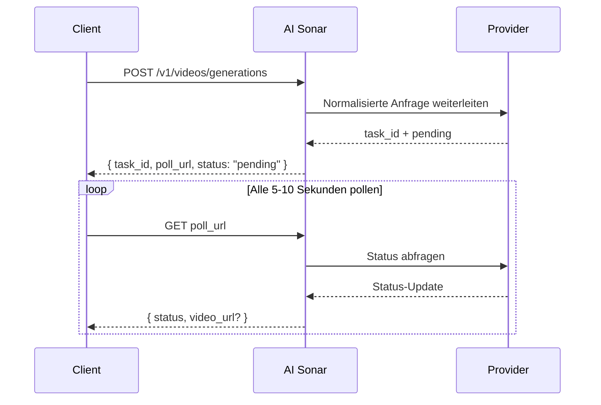

## Überblick

AI Sonar bietet Video-Generierung über eine einheitliche API an. Die Generierung ist **asynchron**: Sie senden eine Anfrage, erhalten `task_id` und `poll_url` und pollen anschließend auf das Endergebnis.

### Verfügbarkeit und Polling

Den aktuellen Bestand öffentlicher Videomodelle finden Sie über die [Models API](/de/api-reference/models/list-models) oder auf der [Modellseite](https://aisonar.dev/models).

Wenn eine Create-Response `poll_url` zurückgibt, verwenden Sie genau diese URL. Wenn sie auf `/v1/tasks/{id}` zeigt, behandeln Sie sie als kanonischen festen Status-Endpunkt.

### Modell- und Medienverhalten

Das Audioverhalten ist modellabhängig. In AI Sonar wird die Veo-3-Familie bei weggelassenem `output_audio` standardmäßig als audio-on behandelt. Andere öffentliche Modelle sind standardmäßig stumm oder veröffentlichen keinen stabilen Audio-Schalter.

In Produktion sollten Sie für Bild-, Video- und Audioeingaben öffentlich erreichbare `https`-URLs bevorzugen. Kompatible Modelle akzeptieren weiterhin `data:`-URLs, aber URLs sind für Retry, Observability und Debugging in der Regel robuster.

### Asynchroner Workflow



## Aktuelle öffentliche Operationen

Der öffentliche Videovertrag von AI Sonar akzeptiert diese Operationswerte. Die Unterstützung ist modellspezifisch und ändert sich, wenn Provider Fähigkeiten hinzufügen oder einstellen. Prüfen Sie daher den Vertrag des ausgewählten Modells, bevor Sie sich auf eine Spezialoperation verlassen.

- `text-to-video`
- `image-to-video`
- `reference-to-video`
- `start-end-to-video`
- `video-to-video`
- `motion-control`
- `audio-to-video`
- `video-extension`

## Operationsdefinitionen

- **T2V (Text-to-Video)**: Video aus einem Text-Prompt erzeugen.
- **I2V (Image-to-Video)**: Ein Startbild animieren. Für die breiteste Kompatibilität `image_url` verwenden.
- **Reference**: Die Generierung mit einem oder mehreren Referenzbildern über `reference_images` konditionieren; einige Modelle akzeptieren Referenzvideos über `video_urls` und Referenzaudio über `audio_urls`.
- **Start-End**: Den ersten und letzten Frame mit `start_image` und `end_image` steuern.
- **V2V (Video-to-Video)**: Ein bestehendes Video, eine generierte Aufgabe oder einen providerspezifischen Ableitungsflow als Quelle nutzen.
- **Motion**: Ein Motivbild mit einem Bewegungsreferenzvideo kombinieren.
- **Audio-to-Video**: Video aus einem audiokonditionierten Modellflow erzeugen.
- **Video Extension**: Eine bestehende Videogenerierungsaufgabe fortsetzen oder verlängern.

## Modellerkennung

Die Verfügbarkeit von Videomodellen ändert sich häufig. Rufen Sie vor der Modellauswahl die aktuelle öffentliche Shortlist ab:

```bash
curl "https://api.aisonar.dev/v1/models?recommended_for=video" \
  -H "Authorization: Bearer sk-your-api-key"
```

Lesen Sie das ausgewählte Modell, bevor Sie modellspezifische Felder senden:

```bash
curl "https://api.aisonar.dev/v1/models/veo3.1" \
  -H "Authorization: Bearer sk-your-api-key"
```

Verwenden Sie `aisonar.capabilities`, `aisonar.supported_operations`, `aisonar.public_contract_summary` und `aisonar.public_contract` als Wahrheitsquelle. Die folgenden Beispiele sind Workflow-Muster, kein vollständiger Modellbestand.

## Verwendungsbeispiele

### Text-zu-Video

```python
response = requests.post(f"{BASE}/videos/generations",
    headers=headers,
    json={
        "model": "veo3.1",
        "prompt": "A calm cinematic shot of a cat walking through a sunlit garden.",
        "operation": "text-to-video",
        "duration": 4,
        "aspect_ratio": "16:9"
    }
)
```

### Bild-zu-Video

```python
response = requests.post(f"{BASE}/videos/generations",
    headers=headers,
    json={
        "model": "hailuo-2.3-standard",
        "prompt": "The scene begins from the provided image and adds gentle natural motion.",
        "operation": "image-to-video",
        "image_url": "https://example.com/portrait.jpg",
        "duration": 6,
        "aspect_ratio": "16:9"
    }
)
```

### Kling 3.0 Elements

Verwenden Sie `kling_elements` mit `kling-3.0-video`, wenn Sie Elementreferenzen benötigen. Senden Sie eine bildkonditionierte Anfrage (`image_url`, `image_urls`, `start_image` oder `end_image`) und referenzieren Sie jedes Element im Prompt mit `@name`. Kombinieren Sie `kling_elements` nicht mit `output_audio=true`; lassen Sie `output_audio` weg oder setzen Sie es für Elementreferenzen auf `false`.

```python
response = requests.post(f"{BASE}/videos/generations",
    headers=headers,
    json={
        "model": "kling-3.0-video",
        "prompt": "Place @hero_bag on a studio turntable with soft product lighting.",
        "operation": "image-to-video",
        "image_url": "https://example.com/studio-start.png",
        "duration": 5,
        "resolution": "720p",
        "kling_elements": [
            {
                "name": "hero_bag",
                "description": "black leather handbag",
                "element_input_urls": [
                    "https://example.com/bag-front.png",
                    "https://example.com/bag-side.png"
                ]
            }
        ]
    }
)
```

### Referenzbild-zu-Video

Für `seedance-2.0` und `seedance-2.0-fast` unterstützt AI Sonar derzeit bis zu 9 Referenzbilder sowie zusätzlich bis zu 3 Referenzvideos und 3 Referenzaudios. `duration` steuert nur die Länge des generierten Outputs und definiert kein separates Dauerlimit für Referenzvideo-Eingaben. Für `grok-imagine-video` akzeptiert reference-to-video bis zu 7 Bildreferenzen (`reference_images` oder `image_urls`) und `duration` ist auf 10 Sekunden begrenzt. Kombinieren Sie Referenzbilder nicht mit `image_url` / `image` als Startbild-Eingaben. `grok-imagine-video-1.5-preview` ist nur image-to-video.

```python
response = requests.post(f"{BASE}/videos/generations",
    headers=headers,
    json={
        "model": "veo3.1",
        "prompt": "Keep the same subject identity and palette while adding subtle motion.",
        "operation": "reference-to-video",
        "reference_images": [
            "https://example.com/ref-a.jpg",
            "https://example.com/ref-b.jpg"
        ],
        "duration": 8,
        "resolution": "720p",
        "aspect_ratio": "9:16"
    }
)
```

### Start- und Endframe-Steuerung

```python
response = requests.post(f"{BASE}/videos/generations",
    headers=headers,
    json={
        "model": "viduq2-pro",
        "prompt": "Smooth transition from day to night.",
        "operation": "start-end-to-video",
        "start_image": "https://example.com/city-day.jpg",
        "end_image": "https://example.com/city-night.jpg",
        "duration": 5,
        "resolution": "720p",
        "aspect_ratio": "16:9"
    }
)
```

### Video-zu-Video

Für `grok-imagine-video` video-to-video senden Sie eine öffentliche HTTPS-`.mp4`-URL in `video_url`. AI Sonar übersetzt sie in den xAI-REST-Body `video.url`. Sie können `resolution` auf `480p` oder `720p` setzen; `duration` und `aspect_ratio` werden für diesen Edit-Flow nicht akzeptiert.

```python
response = requests.post(f"{BASE}/videos/generations",
    headers=headers,
    json={
        "model": "grok-imagine-video",
        "operation": "video-to-video",
        "video_url": "https://example.com/source.mp4",
        "prompt": "Upscale this clip while preserving the original motion."
    }
)
```

### Bewegungssteuerung

```python
response = requests.post(f"{BASE}/videos/generations",
    headers=headers,
    json={
        "model": "kling-3.0-motion-control",
        "operation": "motion-control",
        "prompt": "Keep the subject stable while following the motion reference.",
        "image_url": "https://example.com/subject.png",
        "video_url": "https://example.com/motion.mp4",
        "resolution": "720p"
    }
)
```

## Hinweise zu Parametern

| Parameter | Typ | Hinweis |
|-----------|------|---------|
| `operation` | string | In Produktion explizit angeben |
| `image_url` | string | Robusteste Form für Bildeingaben |
| `image` | string | `data:`-URL für lokale Tests und kleine Integrationen |
| `reference_images` | string[] | Kanonisches öffentliches Feld für Referenzbild-Konditionierung |
| `reference_image_type` | string | Optionaler `asset` / `style`-Schalter |
| `video_url` | string | Für video-URL-basierte `video-to-video`-Flows und `motion-control` erforderlich; einige Ableitungsflows verwenden stattdessen `task_id`. |
| `audio_url` | string | Für modellspezifische Audio-zu-Video-Flows |
| `output_audio` | boolean | Veo-3-Familie behandelt Auslassung als `true`. `kling-3.0-video` akzeptiert diesen Selector für die Upstream-`sound`-Steuerung und bleibt bei Auslassung stumm. |

## Hinweise zur Modellauswahl

<CardGroup cols={2}>
  <Card title="Höchste Qualität" icon="crown">
    Wenn Qualität wichtiger ist als Geschwindigkeit, sind **veo3.1**, **kling-video-o1-pro** und **viduq3-pro** starke Kandidaten.
  </Card>
  <Card title="Schnelle Iteration" icon="bolt">
    Für schnelle Schleifen eignen sich **veo3.1-fast**, **hailuo-2.3-fast** und **viduq3-turbo**.
  </Card>
  <Card title="Referenzbild-Konditionierung" icon="images">
    Für dedizierte Referenzbild-Steuerung sind **veo3.1**, **veo3.1-fast**, **wan-2.6** sowie **kling-video-o1-pro / std** gute Startpunkte.
  </Card>
  <Card title="Video-zu-Video" icon="film">
    Beginnen Sie mit `GET /v1/models?recommended_for=video`; aktuelle V2V-Beispiele sind **grok-imagine-video**, **seedance-2.0**, **veo3.1** und **kling-video-o1-pro / std**.
  </Card>
</CardGroup>

## Abrechnung

Die Abrechnung ist modellabhängig. Einige öffentliche Videomodelle verhalten sich effektiv wie requestbasierte Modelle, andere eher wie sekundenbasierte Modelle. Verlassen Sie sich für die aktuelle öffentliche Preisfläche auf die [Modellseite](https://aisonar.dev/models) oder die [Pricing API](/de/api-reference/pricing/get-pricing).
