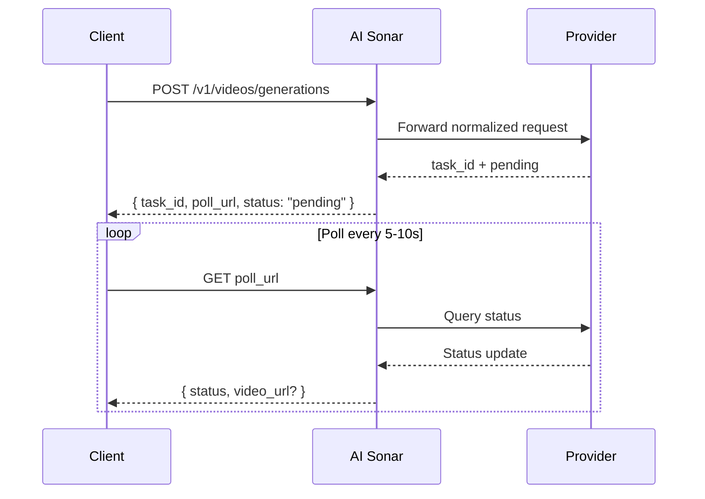

## Overview

AI Sonar provides access to video generation models through a single unified API. Video generation is **asynchronous**: submit a request, receive a task ID and `poll_url`, then poll for the final result.

### Availability and polling

The model inventory changes over time. For the latest public availability, use the [Models API](/api-reference/models/list-models) or visit the [Models page](https://aisonar.dev/models).

If a create response returns `poll_url`, call that exact URL. When it points to `/v1/tasks/{id}`, treat that as the canonical fixed status endpoint.

### Model and media behavior

Audio behavior is model-dependent. In AI Sonar, Veo 3 family requests default to audio-on when `output_audio` is omitted. Some public models are silent-only or do not expose a stable toggle.

For production integrations, prefer publicly reachable `https` URLs over inline base64 for images, videos, and audio. Inline `data:` URLs are still supported by compatible models, but URLs are easier to retry, inspect, and debug.

### Async Workflow



## Public Operations

AI Sonar's public video contract accepts these operation values. Support is model-specific and changes as providers add or retire capabilities, so check the selected model contract before relying on a specialized operation.

- `text-to-video`
- `image-to-video`
- `reference-to-video`
- `start-end-to-video`
- `video-to-video`
- `motion-control`
- `audio-to-video`
- `video-extension`

## Operation Definitions

- **T2V (Text-to-Video)**: Generate video from a text prompt.
- **I2V (Image-to-Video)**: Animate a starting image. For the broadest compatibility, provide `image_url`.
- **Reference**: Condition generation on one or more reference images via `reference_images`; some models also accept reference videos through `video_urls` and reference audio through `audio_urls`.
- **Start-End**: Control the first and last frames with `start_image` and `end_image`.
- **V2V (Video-to-Video)**: Use an existing video, generated task, or provider-specific derivative flow as the source.
- **Motion**: Combine a subject image with a motion reference video.
- **Audio-to-Video**: Generate video from an audio-conditioned model flow.
- **Video Extension**: Continue or extend an existing generated video task.

## Model Discovery

Video model availability changes frequently. Fetch the current public shortlist before choosing a model:

```bash
curl "https://api.aisonar.dev/v1/models?recommended_for=video" \
  -H "Authorization: Bearer sk-your-api-key"
```

Read the selected model before sending model-specific fields:

```bash
curl "https://api.aisonar.dev/v1/models/veo3.1" \
  -H "Authorization: Bearer sk-your-api-key"
```

Use `aisonar.capabilities`, `aisonar.supported_operations`, `aisonar.public_contract_summary`, and `aisonar.public_contract` as the source of truth. The examples below are workflow patterns, not an exhaustive model inventory.

## Usage Examples

### Text-to-Video

```python
response = requests.post(f"{BASE}/videos/generations",
    headers=headers,
    json={
        "model": "veo3.1",
        "prompt": "A calm cinematic shot of a cat walking through a sunlit garden.",
        "operation": "text-to-video",
        "duration": 4,
        "aspect_ratio": "16:9"
    }
)
```

### Image-to-Video

```python
response = requests.post(f"{BASE}/videos/generations",
    headers=headers,
    json={
        "model": "hailuo-2.3-standard",
        "prompt": "The scene begins from the provided image and adds gentle natural motion.",
        "operation": "image-to-video",
        "image_url": "https://example.com/portrait.jpg",
        "duration": 6,
        "aspect_ratio": "16:9"
    }
)
```

### Kling 3.0 Elements

Use `kling_elements` with `kling-3.0-video` when you need element references. Provide an image-conditioned request (`image_url`, `image_urls`, `start_image`, or `end_image`) and reference each element in the prompt with `@name`. Do not combine `kling_elements` with `output_audio=true`; omit `output_audio` or set it to `false` for element-reference requests.

```python
response = requests.post(f"{BASE}/videos/generations",
    headers=headers,
    json={
        "model": "kling-3.0-video",
        "prompt": "Place @hero_bag on a studio turntable with soft product lighting.",
        "operation": "image-to-video",
        "image_url": "https://example.com/studio-start.png",
        "duration": 5,
        "resolution": "720p",
        "kling_elements": [
            {
                "name": "hero_bag",
                "description": "black leather handbag",
                "element_input_urls": [
                    "https://example.com/bag-front.png",
                    "https://example.com/bag-side.png"
                ]
            }
        ]
    }
)
```

### Reference-to-Video

For `seedance-2.0` and `seedance-2.0-fast`, AI Sonar currently supports up to 9 reference images plus up to 3 reference videos and 3 reference audios. `duration` controls generated output length only; it does not define a separate reference video input duration limit. For `grok-imagine-video`, reference-to-video accepts up to 7 image references (`reference_images` or `image_urls`) and `duration` is capped at 10 seconds. Do not combine reference images with `image_url` / `image` first-frame inputs. `grok-imagine-video-1.5-preview` is image-to-video only.

```python
response = requests.post(f"{BASE}/videos/generations",
    headers=headers,
    json={
        "model": "veo3.1",
        "prompt": "Keep the same subject identity and palette while adding subtle motion.",
        "operation": "reference-to-video",
        "reference_images": [
            "https://example.com/ref-a.jpg",
            "https://example.com/ref-b.jpg"
        ],
        "duration": 8,
        "resolution": "720p",
        "aspect_ratio": "9:16"
    }
)
```

### Start-End-to-Video

```python
response = requests.post(f"{BASE}/videos/generations",
    headers=headers,
    json={
        "model": "viduq2-pro",
        "prompt": "Smooth transition from day to night.",
        "operation": "start-end-to-video",
        "start_image": "https://example.com/city-day.jpg",
        "end_image": "https://example.com/city-night.jpg",
        "duration": 5,
        "resolution": "720p",
        "aspect_ratio": "16:9"
    }
)
```

### Video-to-Video

For `grok-imagine-video` video-to-video, send a public HTTPS `.mp4` URL in `video_url`. AI Sonar translates it to xAI's REST `video.url` body. You may set `resolution` to `480p` or `720p`; `duration` and `aspect_ratio` are not accepted for that edit flow.

```python
response = requests.post(f"{BASE}/videos/generations",
    headers=headers,
    json={
        "model": "grok-imagine-video",
        "operation": "video-to-video",
        "video_url": "https://example.com/source.mp4",
        "prompt": "Upscale this clip while preserving the original motion."
    }
)
```

### Motion Control

```python
response = requests.post(f"{BASE}/videos/generations",
    headers=headers,
    json={
        "model": "kling-3.0-motion-control",
        "operation": "motion-control",
        "prompt": "Keep the subject stable while following the motion reference.",
        "image_url": "https://example.com/subject.png",
        "video_url": "https://example.com/motion.mp4",
        "resolution": "720p"
    }
)
```

## Parameters Reference

| Parameter | Type | Notes |
|-----------|------|-------|
| `operation` | string | Explicit `operation` is recommended in production. |
| `image_url` | string | Preferred image input form for broad cross-model compatibility. |
| `image` | string | Inline data URL; useful for debugging and small local integrations. |
| `reference_images` | string[] | Canonical public field for reference-image conditioning. |
| `reference_image_type` | string | Optional `asset` / `style` selector when supported. |
| `video_url` | string | Required for video-url based `video-to-video` flows and for `motion-control`; some derivative flows use `task_id` instead. |
| `audio_url` | string | Used by model-specific audio-conditioned flows when available. |
| `output_audio` | boolean | Veo 3 family defaults to `true` when omitted. `kling-3.0-video` accepts this selector for upstream sound control and defaults to silent output when omitted. |

## Model Selection Guide

<CardGroup cols={2}>
  <Card title="Best Quality" icon="crown">
    **veo3.1**, **kling-video-o1-pro**, and **viduq3-pro** are strong choices when fidelity matters more than speed.
  </Card>
  <Card title="Fastest Public Options" icon="bolt">
    **veo3.1-fast**, **hailuo-2.3-fast**, and **viduq3-turbo** are good starting points for faster iteration.
  </Card>
  <Card title="Reference-Heavy Flows" icon="images">
    Use **veo3.1**, **veo3.1-fast**, **wan-2.6**, or **kling-video-o1-pro / std** when you need dedicated reference-image conditioning.
  </Card>
  <Card title="Video-to-Video" icon="film">
    Start with `GET /v1/models?recommended_for=video`; current V2V-style examples include **grok-imagine-video**, **seedance-2.0**, **veo3.1**, and **kling-video-o1-pro / std**.
  </Card>
</CardGroup>

## Billing

Billing is model-dependent. Some public video models are effectively priced per request, while others are priced per second. Check the [Models page](https://aisonar.dev/models) or the [Pricing API](/api-reference/pricing/get-pricing) for the current public price surface.
