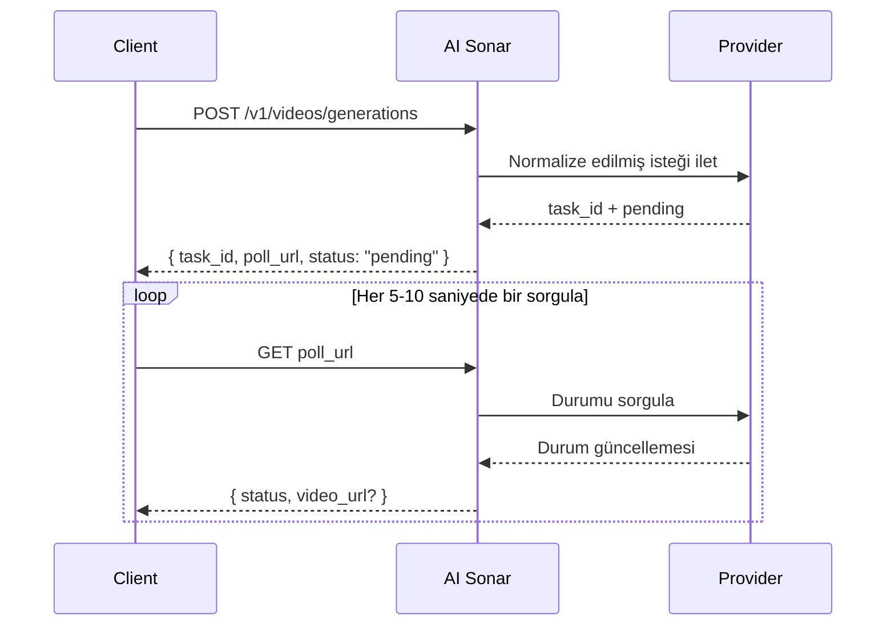

## Genel bakış

AI Sonar video oluşturmayı tek bir birleşik API üzerinden sunar. Üretim **asenkron** olarak çalışır: istek gönderirsiniz, `task_id` ve `poll_url` alırsınız, ardından nihai sonuç hazır olana kadar durumu düzenli olarak sorgularsınız.

### Kullanılabilirlik ve polling

Eğer oluşturma yanıtı `poll_url` döndürüyorsa, doğrudan o adresi kullanın. Bu URL `/v1/tasks/{id}` ise, bunu video işleri için kanonik durum uç noktası olarak kabul edin; `/v1/videos/generations/{id}` yalnızca geriye dönük uyumluluk içindir.

Güncel herkese açık video modeli envanterini [Models API](/tr/api-reference/models/list-models) üzerinden veya [modeller sayfasında](https://aisonar.dev/models) görebilirsiniz.

### Model ve medya davranışı

Ses davranışı modele bağlıdır. AI Sonar’da `output_audio` gönderilmezse Veo 3 ailesi varsayılan olarak sesi açık kabul eder. Diğer herkese açık modeller sessiz olabilir ya da kararlı bir ses anahtarı sunmayabilir.

Üretim entegrasyonlarında görsel, video ve ses girdileri için herkese açık `https` URL’lerini tercih edin. Uyumlu modeller `data:` URL’lerini kabul etmeye devam eder, ancak herkese açık URL’ler yeniden deneme, gözlemlenebilirlik ve hata ayıklama açısından daha sağlamdır.

### Asenkron akış



## Güncel herkese açık işlemler

AI Sonar'ın herkese açık video sözleşmesi şu işlem değerlerini kabul eder. Destek modele özeldir ve sağlayıcılar yetenek ekledikçe veya kaldırdıkça değişir; özel bir işleme güvenmeden önce seçilen model sözleşmesini okuyun.

- `text-to-video`
- `image-to-video`
- `reference-to-video`
- `start-end-to-video`
- `video-to-video`
- `motion-control`
- `audio-to-video`
- `video-extension`

## İşlem tanımları

- **T2V (Text-to-Video)**: metin prompt'undan video üretir.
- **I2V (Image-to-Video)**: başlangıç görselini canlandırır. En geniş uyumluluk için `image_url` kullanın.
- **Reference**: `reference_images` ile bir veya daha fazla referans görsel üzerinden üretimi koşullandırır; bazı modeller `video_urls` üzerinden referans video ve `audio_urls` üzerinden referans ses de kabul eder.
- **Start-End**: `start_image` ve `end_image` ile ilk ve son kareyi kontrol eder.
- **V2V (Video-to-Video)**: mevcut bir videoyu, oluşturulmuş bir görevi veya sağlayıcıya özgü türev akışı kaynak olarak kullanır.
- **Motion**: özne görselini hareket referans videosuyla birleştirir.
- **Audio-to-Video**: ses koşullu bir model akışından video üretir.
- **Video Extension**: mevcut bir video oluşturma görevini sürdürür veya uzatır.

## Model keşfi

Video modeli kullanılabilirliği sık değişir. Model seçmeden önce güncel herkese açık kısa listeyi alın:

```bash
curl "https://api.aisonar.dev/v1/models?recommended_for=video" \
  -H "Authorization: Bearer sk-your-api-key"
```

Modele özgü alanları göndermeden önce seçilen modeli okuyun:

```bash
curl "https://api.aisonar.dev/v1/models/veo3.1" \
  -H "Authorization: Bearer sk-your-api-key"
```

Gerçek kaynak olarak `aisonar.capabilities`, `aisonar.supported_operations`, `aisonar.public_contract_summary` ve `aisonar.public_contract` alanlarını kullanın. Aşağıdaki örnekler iş akışı kalıplarıdır, eksiksiz model envanteri değildir.

## Kullanım örnekleri

### Text-to-video

```python
response = requests.post(f"{BASE}/videos/generations",
    headers=headers,
    json={
        "model": "veo3.1",
        "prompt": "A calm cinematic shot of a cat walking through a sunlit garden.",
        "operation": "text-to-video",
        "duration": 4,
        "aspect_ratio": "16:9"
    }
)
```

### Görselden videoya

```python
response = requests.post(f"{BASE}/videos/generations",
    headers=headers,
    json={
        "model": "hailuo-2.3-standard",
        "prompt": "The scene begins from the provided image and adds gentle natural motion.",
        "operation": "image-to-video",
        "image_url": "https://example.com/portrait.jpg",
        "duration": 6,
        "aspect_ratio": "16:9"
    }
)
```

### Kling 3.0 Elements

Öğe referanslarına ihtiyacınız olduğunda `kling_elements` alanını `kling-3.0-video` ile kullanın. Görüntü koşullu bir istek (`image_url`, `image_urls`, `start_image` veya `end_image`) sağlayın ve prompt içinde her öğeyi `@name` ile referanslayın. `kling_elements` ile `output_audio=true` birlikte kullanılamaz; öğe referanslı isteklerde `output_audio` alanını kaldırın veya `false` yapın.

```python
response = requests.post(f"{BASE}/videos/generations",
    headers=headers,
    json={
        "model": "kling-3.0-video",
        "prompt": "Place @hero_bag on a studio turntable with soft product lighting.",
        "operation": "image-to-video",
        "image_url": "https://example.com/studio-start.png",
        "duration": 5,
        "resolution": "720p",
        "kling_elements": [
            {
                "name": "hero_bag",
                "description": "black leather handbag",
                "element_input_urls": [
                    "https://example.com/bag-front.png",
                    "https://example.com/bag-side.png"
                ]
            }
        ]
    }
)
```

### Reference-to-video

`seedance-2.0` ve `seedance-2.0-fast` için AI Sonar şu anda en fazla 9 referans görseli, ayrıca en fazla 3 referans video ve 3 referans sesi destekler. `duration` yalnızca üretilen çıktının süresini kontrol eder; referans video girdisi için ayrı bir süre sınırı tanımlamaz. `grok-imagine-video` için reference-to-video en fazla 7 görüntü referansı (`reference_images` veya `image_urls`) kabul eder ve `duration` en fazla 10 saniyedir. Referans görüntüleri `image_url` / `image` ilk kare girdileriyle birlikte göndermeyin. `grok-imagine-video-1.5-preview` yalnızca image-to-video destekler.

```python
response = requests.post(f"{BASE}/videos/generations",
    headers=headers,
    json={
        "model": "veo3.1",
        "prompt": "Keep the same subject identity and palette while adding subtle motion.",
        "operation": "reference-to-video",
        "reference_images": [
            "https://example.com/ref-a.jpg",
            "https://example.com/ref-b.jpg"
        ],
        "duration": 8,
        "resolution": "720p",
        "aspect_ratio": "9:16"
    }
)
```

### Start-end-to-video

```python
response = requests.post(f"{BASE}/videos/generations",
    headers=headers,
    json={
        "model": "viduq2-pro",
        "prompt": "Smooth transition from day to night.",
        "operation": "start-end-to-video",
        "start_image": "https://example.com/city-day.jpg",
        "end_image": "https://example.com/city-night.jpg",
        "duration": 5,
        "resolution": "720p",
        "aspect_ratio": "16:9"
    }
)
```

### Videodan videoya

`grok-imagine-video` video-to-video için `video_url` içinde herkese açık HTTPS `.mp4` URL gönderin. AI Sonar bunu xAI REST `video.url` gövdesine çevirir. `resolution` için `480p` veya `720p` gönderebilirsiniz; bu düzenleme akışı `duration` ve `aspect_ratio` kabul etmez.

```python
response = requests.post(f"{BASE}/videos/generations",
    headers=headers,
    json={
        "model": "grok-imagine-video",
        "operation": "video-to-video",
        "video_url": "https://example.com/source.mp4",
        "prompt": "Upscale this clip while preserving the original motion."
    }
)
```

### Motion control

```python
response = requests.post(f"{BASE}/videos/generations",
    headers=headers,
    json={
        "model": "kling-3.0-motion-control",
        "operation": "motion-control",
        "prompt": "Keep the subject stable while following the motion reference.",
        "image_url": "https://example.com/subject.png",
        "video_url": "https://example.com/motion.mp4",
        "resolution": "720p"
    }
)
```

## Parametre referansı

| Parametre | Tür | Not |
|-----------|-----|-----|
| `operation` | string | Üretimde açıkça göndermeniz önerilir |
| `image_url` | string | Görsel girdileri için en sağlam biçim |
| `image` | string | Yerel testler ve küçük entegrasyonlar için `data:` URL |
| `reference_images` | string[] | Referans görsel koşullandırması için kanonik herkese açık alan |
| `reference_image_type` | string | İsteğe bağlı `asset` / `style` seçicisi |
| `video_url` | string | Video URL tabanlı `video-to-video` akışları ve `motion-control` için gereklidir; bazı türev akışlar bunun yerine `task_id` kullanır. |
| `audio_url` | string | Uygun olduğunda modele özgü ses koşullu akışlarda kullanılır |
| `output_audio` | boolean | Veo 3 ailesi alan gönderilmezse `true` kabul eder. `kling-3.0-video` bu seçiciyi upstream `sound` kontrolü için kabul eder ve alan atlanırsa sessizdir. |

## Hızlı model seçimi rehberi

<CardGroup cols={2}>
  <Card title="En yüksek kalite" icon="crown">
    Kalite hızdan daha önemliyse **veo3.1**, **kling-video-o1-pro** ve **viduq3-pro** güçlü seçeneklerdir.
  </Card>
  <Card title="Hızlı iterasyon" icon="bolt">
    Hızlı denemeler için **veo3.1-fast**, **hailuo-2.3-fast** ve **viduq3-turbo** iyi başlangıç noktalarıdır.
  </Card>
  <Card title="Referans ağırlıklı akışlar" icon="images">
    Özel referans görsel kontrolü gerekiyorsa **veo3.1**, **veo3.1-fast**, **wan-2.6** veya **kling-video-o1-pro / std** ile başlayın.
  </Card>
  <Card title="Videodan videoya" icon="film">
    `GET /v1/models?recommended_for=video` ile başlayın; güncel V2V tarzı örnekler arasında **grok-imagine-video**, **seedance-2.0**, **veo3.1** ve **kling-video-o1-pro / std** bulunur.
  </Card>
</CardGroup>

## Faturalama

Faturalama modele bağlıdır. Bazı herkese açık video modelleri pratikte istek başına fiyatlandırılırken, bazıları saniye bazlı fiyatlandırmaya daha yakındır. Güncel herkese açık fiyat yüzeyi için [modeller sayfasına](https://aisonar.dev/models) veya [Pricing API](/tr/api-reference/pricing/get-pricing) bakın.
