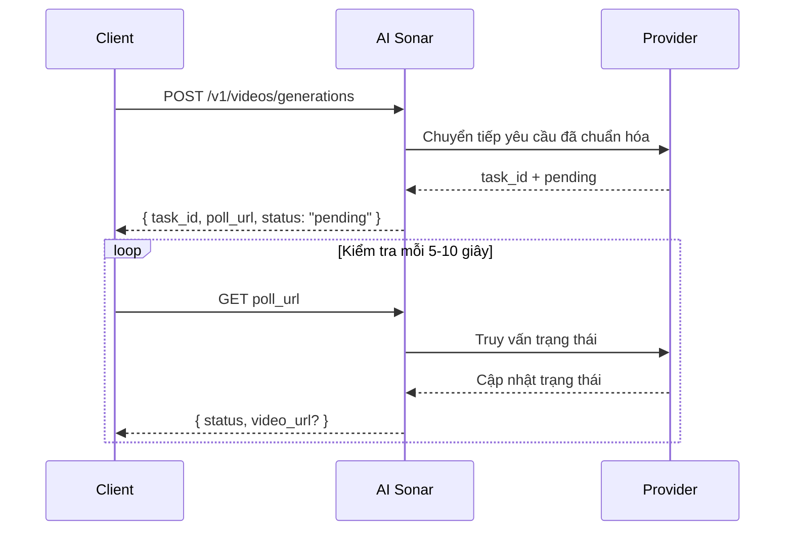

## Tổng quan

AI Sonar cung cấp khả năng tạo video thông qua một API hợp nhất. Quá trình này **bất đồng bộ**: bạn gửi yêu cầu, nhận `task_id` và `poll_url`, rồi kiểm tra trạng thái định kỳ cho tới khi có kết quả cuối cùng.

### Tính khả dụng và polling

Danh sách model video công khai có thể thay đổi theo thời gian. Để xem tình trạng mới nhất, hãy dùng [Models API](/vi/api-reference/models/list-models) hoặc truy cập [trang Models](https://aisonar.dev/models).

Nếu phản hồi tạo trả về `poll_url`, hãy gọi đúng URL đó. Khi nó trỏ tới `/v1/tasks/{id}`, hãy xem đó là endpoint trạng thái cố định chuẩn.

### Hành vi mô hình và phương tiện

Hành vi âm thanh phụ thuộc vào từng model. Trong AI Sonar, họ Veo 3 mặc định bật âm thanh khi bỏ qua `output_audio`. Một số model công khai chỉ hỗ trợ im lặng hoặc không cung cấp công tắc âm thanh ổn định.

Trong môi trường vận hành, nên ưu tiên URL `https` công khai thay vì base64 inline cho ảnh, video và âm thanh. Các model tương thích vẫn hỗ trợ URL `data:`, nhưng URL công khai sẽ dễ retry, kiểm tra và debug hơn.

### Quy trình bất đồng bộ



## Các thao tác công khai hiện tại

Hợp đồng video công khai của AI Sonar chấp nhận các giá trị thao tác sau. Khả năng hỗ trợ phụ thuộc vào từng model và thay đổi khi nhà cung cấp thêm hoặc gỡ năng lực; hãy đọc hợp đồng của model đã chọn trước khi dựa vào một thao tác chuyên biệt.

- `text-to-video`
- `image-to-video`
- `reference-to-video`
- `start-end-to-video`
- `video-to-video`
- `motion-control`
- `audio-to-video`
- `video-extension`

## Định nghĩa thao tác

- **T2V (Text-to-Video)**: Tạo video từ prompt văn bản.
- **I2V (Image-to-Video)**: Tạo chuyển động từ ảnh đầu vào. Để tương thích rộng nhất, hãy dùng `image_url`.
- **Reference**: Điều kiện hóa quá trình sinh bằng một hoặc nhiều ảnh tham chiếu qua `reference_images`; một số model cũng nhận video tham chiếu qua `video_urls` và audio tham chiếu qua `audio_urls`.
- **Start-End**: Điều khiển khung đầu và khung cuối bằng `start_image` và `end_image`.
- **V2V (Video-to-Video)**: Dùng video có sẵn, task đã tạo hoặc luồng phái sinh riêng của nhà cung cấp làm nguồn.
- **Motion**: Kết hợp ảnh chủ thể với video tham chiếu chuyển động.
- **Audio-to-Video**: Tạo video từ luồng model được điều kiện hóa bằng audio.
- **Video Extension**: Tiếp tục hoặc kéo dài một task tạo video hiện có.

## Khám phá model

Tính khả dụng của model video thay đổi thường xuyên. Hãy lấy shortlist công khai hiện tại trước khi chọn model:

```bash
curl "https://api.aisonar.dev/v1/models?recommended_for=video" \
  -H "Authorization: Bearer sk-your-api-key"
```

Đọc model đã chọn trước khi gửi các trường riêng của model:

```bash
curl "https://api.aisonar.dev/v1/models/veo3.1" \
  -H "Authorization: Bearer sk-your-api-key"
```

Dùng `aisonar.capabilities`, `aisonar.supported_operations`, `aisonar.public_contract_summary` và `aisonar.public_contract` làm nguồn sự thật. Các ví dụ bên dưới là mẫu workflow, không phải danh sách model đầy đủ.

## Ví dụ sử dụng

### Text-to-video

```python
response = requests.post(f"{BASE}/videos/generations",
    headers=headers,
    json={
        "model": "veo3.1",
        "prompt": "A calm cinematic shot of a cat walking through a sunlit garden.",
        "operation": "text-to-video",
        "duration": 4,
        "aspect_ratio": "16:9"
    }
)
```

### Ảnh thành video

```python
response = requests.post(f"{BASE}/videos/generations",
    headers=headers,
    json={
        "model": "hailuo-2.3-standard",
        "prompt": "The scene begins from the provided image and adds gentle natural motion.",
        "operation": "image-to-video",
        "image_url": "https://example.com/portrait.jpg",
        "duration": 6,
        "aspect_ratio": "16:9"
    }
)
```

### Kling 3.0 Elements

Dùng `kling_elements` với `kling-3.0-video` khi cần tham chiếu phần tử. Cung cấp request có điều kiện ảnh (`image_url`, `image_urls`, `start_image` hoặc `end_image`) và tham chiếu từng phần tử trong prompt bằng `@name`. Không kết hợp `kling_elements` với `output_audio=true`; hãy bỏ `output_audio` hoặc đặt thành `false` khi dùng tham chiếu phần tử.

```python
response = requests.post(f"{BASE}/videos/generations",
    headers=headers,
    json={
        "model": "kling-3.0-video",
        "prompt": "Place @hero_bag on a studio turntable with soft product lighting.",
        "operation": "image-to-video",
        "image_url": "https://example.com/studio-start.png",
        "duration": 5,
        "resolution": "720p",
        "kling_elements": [
            {
                "name": "hero_bag",
                "description": "black leather handbag",
                "element_input_urls": [
                    "https://example.com/bag-front.png",
                    "https://example.com/bag-side.png"
                ]
            }
        ]
    }
)
```

### Reference-to-video

Với `seedance-2.0` và `seedance-2.0-fast`, AI Sonar hiện hỗ trợ tối đa 9 ảnh tham chiếu, cùng thêm tối đa 3 video tham chiếu và 3 audio tham chiếu. `duration` chỉ điều khiển độ dài đầu ra được tạo; nó không định nghĩa giới hạn riêng cho thời lượng video tham chiếu đầu vào. Với `grok-imagine-video`, reference-to-video chấp nhận tối đa 7 tham chiếu ảnh (`reference_images` hoặc `image_urls`) và `duration` tối đa là 10 giây. Không kết hợp ảnh tham chiếu với đầu vào khung đầu `image_url` / `image`. `grok-imagine-video-1.5-preview` chỉ hỗ trợ image-to-video.

```python
response = requests.post(f"{BASE}/videos/generations",
    headers=headers,
    json={
        "model": "veo3.1",
        "prompt": "Keep the same subject identity and palette while adding subtle motion.",
        "operation": "reference-to-video",
        "reference_images": [
            "https://example.com/ref-a.jpg",
            "https://example.com/ref-b.jpg"
        ],
        "duration": 8,
        "resolution": "720p",
        "aspect_ratio": "9:16"
    }
)
```

### Start-end-to-video

```python
response = requests.post(f"{BASE}/videos/generations",
    headers=headers,
    json={
        "model": "viduq2-pro",
        "prompt": "Smooth transition from day to night.",
        "operation": "start-end-to-video",
        "start_image": "https://example.com/city-day.jpg",
        "end_image": "https://example.com/city-night.jpg",
        "duration": 5,
        "resolution": "720p",
        "aspect_ratio": "16:9"
    }
)
```

### Video sang video

Với video-to-video của `grok-imagine-video`, hãy gửi URL HTTPS công khai dạng `.mp4` trong `video_url`. AI Sonar chuyển nó thành body REST `video.url` của xAI. Bạn có thể đặt `resolution` là `480p` hoặc `720p`; luồng chỉnh sửa này không nhận `duration` và `aspect_ratio`.

```python
response = requests.post(f"{BASE}/videos/generations",
    headers=headers,
    json={
        "model": "grok-imagine-video",
        "operation": "video-to-video",
        "video_url": "https://example.com/source.mp4",
        "prompt": "Upscale this clip while preserving the original motion."
    }
)
```

### Motion control

```python
response = requests.post(f"{BASE}/videos/generations",
    headers=headers,
    json={
        "model": "kling-3.0-motion-control",
        "operation": "motion-control",
        "prompt": "Keep the subject stable while following the motion reference.",
        "image_url": "https://example.com/subject.png",
        "video_url": "https://example.com/motion.mp4",
        "resolution": "720p"
    }
)
```

## Tham chiếu tham số

| Tham số | Kiểu | Ghi chú |
|---------|------|---------|
| `operation` | string | Trong môi trường vận hành, nên truyền một cách tường minh |
| `image_url` | string | Dạng đầu vào ảnh ổn định nhất |
| `image` | string | URL `data:` hữu ích cho thử nghiệm cục bộ và tích hợp nhỏ |
| `reference_images` | string[] | Trường công khai chuẩn cho conditioning bằng ảnh tham chiếu |
| `reference_image_type` | string | Bộ chọn tùy chọn `asset` / `style` |
| `video_url` | string | Bắt buộc với các luồng `video-to-video` dựa trên URL video và với `motion-control`; một số luồng phái sinh dùng `task_id` thay thế. |
| `audio_url` | string | Dùng cho các luồng sinh video có điều kiện bằng âm thanh nếu model hỗ trợ |
| `output_audio` | boolean | Họ Veo 3 sẽ coi trường bị bỏ qua là `true`. `kling-3.0-video` chấp nhận selector này cho điều khiển upstream `sound` và mặc định im lặng khi bỏ qua. |

## Hướng dẫn chọn model nhanh

<CardGroup cols={2}>
  <Card title="Chất lượng cao nhất" icon="crown">
    Nếu chất lượng quan trọng hơn tốc độ, **veo3.1**, **kling-video-o1-pro**, và **viduq3-pro** là những lựa chọn mạnh.
  </Card>
  <Card title="Lặp nhanh" icon="bolt">
    Nếu cần thử nghiệm nhanh, bạn có thể bắt đầu với **veo3.1-fast**, **hailuo-2.3-fast**, hoặc **viduq3-turbo**.
  </Card>
  <Card title="Luồng nhiều ảnh tham chiếu" icon="images">
    Khi cần conditioning chuyên biệt bằng ảnh tham chiếu, hãy ưu tiên **veo3.1**, **veo3.1-fast**, **wan-2.6**, hoặc **kling-video-o1-pro / std**.
  </Card>
  <Card title="Video sang video" icon="film">
    Bắt đầu với `GET /v1/models?recommended_for=video`; các ví dụ kiểu V2V hiện tại gồm **grok-imagine-video**, **seedance-2.0**, **veo3.1** và **kling-video-o1-pro / std**.
  </Card>
</CardGroup>

## Thanh toán

Billing phụ thuộc vào model. Một số model video công khai thực tế gần với cách tính phí theo request, trong khi một số model khác gần với cách tính theo thời lượng giây. Để xem mặt bằng giá công khai hiện tại, hãy tham khảo [trang Models](https://aisonar.dev/models) hoặc [Pricing API](/vi/api-reference/pricing/get-pricing).
